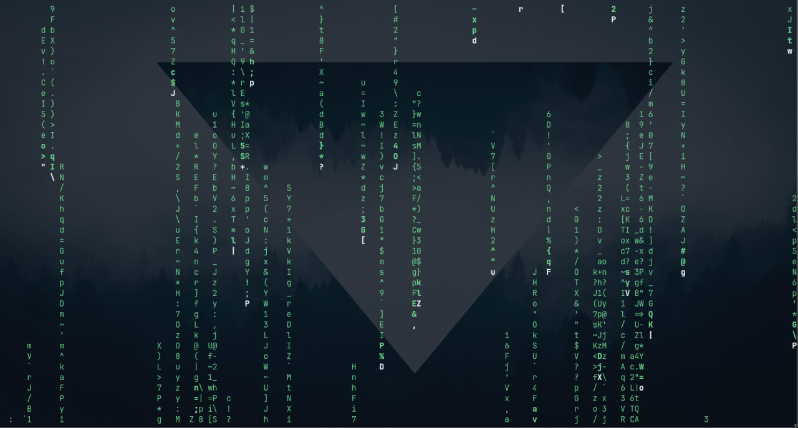

# Матричный дождь на C++



Простое консольное приложение для POSIX-совместимых систем (Linux, macOS), которое симулирует эффект "цифрового дождя" из фильма "Матрица".

Этот проект был создан в качестве учебного упражнения с помощью AI-ассистента (ChatGPT от OpenAI) для изучения консольной графики на C++.

Английская версия доступна в файле [README.md](README.md).

## Возможности
- **Фокус на Linux/POSIX**: Чистый и простой код без усложнений для кросс-платформенности.
- **Без внешних библиотек**: Использует только стандартную библиотеку C++ и стандартные заголовки POSIX.
- **Визуальные эффекты**: Применяет ANSI-коды для управления цветом и позицией курсора.

## Как скомпилировать и запустить
Вам понадобится C++ компилятор, например, `g++`.

# Скомпилировать исходный код
```bash
git clone https://github.com/Sam1624/matrix-rain-cpp.git
cd matrix-rain-cpp
g++ main.cpp -o matrix_rain -std=c++17 -pthread
```
# Запустить приложение
```bash
./matrix_rain
```
